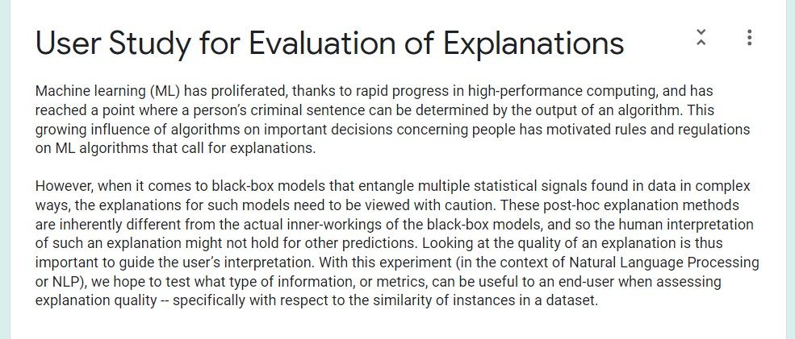
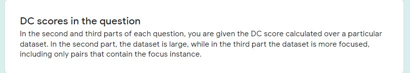

# informer
Welcome to the Informer library. This is the developmental code and supplementary material for the paper *Explain your Explanation: Understanding Metrics for Explanation Quality*. Submission for CHI 2023.
## Table of Contents
1. [Supplementary Material: User study screenshots](#supplementary-material-user-study) 
    1. [User study 1: CEA](#user-study-1-cea)
    2. [User study 2: DC](#user-study-2-dc)
3. [Code description](#code-description)
4. [Instructions to run demo](#demo-instructions)
## Supplementary Material: User Study
The user studies were conducted using Google Forms. Below are screenshots of the instructions, background, and questions provided to the participants. Red asterisks indicate required questions. User study 1 consists of two parts (for two different tasks, SST2 and MNLI) and both user studies have a set of preliminary questions for participant orientation. Please refer to our research paper *Explain your Explanation: Understanding Metrics for Explanation Quality* for results and description of the set up. 
### User Study 1: CEA
1. [Part 1 (SST2): Background](#part-1-sst2-background)
2. [Part 1 (SST2): Preliminary Question](#part-1-sst2-preliminary-question)
3. [Part 1 (SST2): Question Instructions](#part-1-sst2-question-instructions)
4. [Part 1 (SST2): Question Example](#part-1-sst2-question-example)
5. [Part 2 (MNLI): Background](#part-2-mnli-background)
6. [Part 2 (MNLI): Preliminary Question](#part-2-mnli-preliminary-question)
7. [Part 2 (MNLI): Question Example](#part-2-mnli-question-example)
#### Part 1 (SST2): Background

#### Part 1 (SST2): Preliminary Question

#### Part 1 (SST2): Question Instructions

#### Part 1 (SST2): Question Example
Each question had a part A and B where the CEA was not provided in the first version of the question (above), and was provided in the second version (below). 

#### Part 2 (MNLI): Background

#### Part 2 (MNLI): Preliminary Question

#### Part 2 (MNLI): Question Example

### User Study 2: DC
1. [Introduction](#introduction)
2. [Background & Preliminary Questions](#background--preliminary-questions)
3. [Question Example](#question-example)
#### Introduction

#### Background & Preliminary Questions

#### Question Example
Each question had three parts, where the DC score was not provided in the first part (top), a global DC score was provided in the second part (middle) and an instance-level DC score was provided in the third part (bottom) of the question. 

## Code Description
Currently, this library is not intended for use. However, we have some limited functionality that provides tools to create synthetic data and metrics to evaluate the quality of input token based salience score explanation. The tools are meant to be model and explanation method agnostic (except for the DC metric which requires a PyTorch model with a forward function). To run metrics code, you ned to create an Informers object from the pipeline.py also available in the informers_specs_util.py 
**Implemented metrics (see metrics folder)**:
* Confidence-Explanation Agreement (CEA)
* Confidence Indication(CI)
* Dataset Consistency (DC)
* Token Consistency (TC)
  **Automatic synthetic data generation tools**:
* Adjunct removal
* Synonym replacement

  We also have a user interface with limited functionality available in website_demo/. 

## Demo Instructions: 
In order to run a demo file (available for CEA and CI with a demo model and dataset and LIME explainer), follow these steps which utilize Google's Language Interpretability Tool (LIT) for the model, dataset (Binary Sentiment Classification, Stanford Sentiment Treebank SST2) and LIME:
1. Create and activate a lit-nlp environment to download packages needed to run LIT 
<pre><code> 
conda env create -f environment.yml
conda activate lit-nlp
</code></pre>
2. Unzip the lit-nlp.zip 
3. run demo/cea_demo.py or demo/ci_demo.py

## References
1. Ian Tenney, James Wexler, Jasmijn Bastings, Tolga
Bolukbasi, Andy Coenen, Sebastian Gehrmann,
Ellen Jiang, Mahima Pushkarna, Carey Radebaugh,
Emily Reif, and Ann Yuan. 2020. The language inter-
pretability tool: Extensible, interactive visualizations
and analysis for NLP models.
2. Pepa Atanasova, Jakob Grue Simonsen, Christina Li-
oma, and Isabelle Augenstein. 2020. A diagnostic
study of explainability techniques for text classifi-
cation. In Proceedings of the 2020 Conference on
Empirical Methods in Natural Language Processing
(EMNLP), pages 3256–3274, Online. Association for
Computational Linguistics.
3. Marco Ribeiro, Sameer Singh, and Carlos Guestrin.
2016. “why should I trust you?”: Explaining the pre-
dictions of any classifier. In Proceedings of the 2016
Conference of the North American Chapter of the
Association for Computational Linguistics: Demon-
strations, pages 97–101, San Diego, California. As-
sociation for Computational Linguistics.
